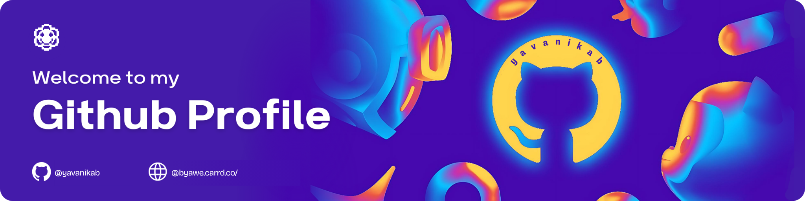

<!-- BANNER IMAGE -->

<!-- HEADING 1 -->

<h1 align="left">
Hi there ,
I'm Yavanikab. 
</h1>

<!-- HEADING 2 -->

    <h3 align="left"> I build open-source tools for developers </sub</h3>

### Projects

| Project | What it is |
|---|---|
| **[Doto](https://github.com/YOUR_USERNAME/doto)** | Windows desktop checklist app. Plain Markdown files. No accounts. |
| **SQL Visualizer** | *(coming soon)* |
| **Wispr Stories** | *(coming soon)* |
| **AI Decoded** | *(coming soon)* |

Building things that make developers' lives easier. [Buy Me a Coffee](https://buymeacoffee.com/why25) ☕

<!-- LINE -->

<!-- 
 -->

<!-- TOOLS | SKILLS -->
<h3 align="left"> Languages & Skills Stack </h3>

<!--  -->
          
  

</a>

 

<!-- Other Communities -->
<h3> Other Communities </h3>

 

 

<!-- LINE -->

<!-- TROPHIES -->
<h2 align="center">
 GitHub Trophies </h2>

  

<!-- GITHUB STATS -->
<h2 align="center">
  GitHub Stats 
</h2>
<table align="center"> <!-- TABLE STATS -->
  <tr>
    <td>
    
    </td>
    <th></th>
  </tr>
    <tr>
    <td colspan="2">
  
    </td>
  </tr>
</table>

 

<!-- PROFILE VIEWS -->

<!--     <a href="https://visitcount.itsvg.in"> -->
<!--     </a> -->

	

<!-- THANKS -->
<h3 align= "center">
   Thanks for swinging by my profile! 
</h3> 

<!-- STAR -->

	<h4>If this repo made you smile, give it a  and watch it shine like a disco ball !!</h4>

 
 

	

<!-- waving footer -->

<!--      -->
    

<!--
**balaga-yavanika/balaga-yavanika** is a ✨ _special_ ✨ repository because its `README.md` (this file) appears on your GitHub profile.

Here are some ideas to get you started:

- 🔭 I’m currently working on ...
- 🌱 I’m currently learning ...
- 👯 I’m looking to collaborate on ...
- 🤔 I’m looking for help with ...
- 💬 Ask me about ...
- 📫 How to reach me: ...
- 😄 Pronouns: ...
- ⚡ Fun fact: ...
-->
